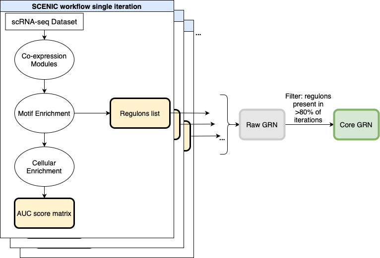

# Evaluating ML Network Inference on a Complex Dataset (Master's Thesis)

## Overview  
This thesis assessed the performance of machine learning techniques in extracting meaningful patterns from complex, high-dimensional, and noisy real-world data. We compared a ML-inferred network model against an expert-defined logical model.

## Network Inference Workflow
The diagram below illustrates the workflow used for network inference from the single-cell data.

## Tools & Skills  
**Languages**: Python, R  
**Frameworks & Tools**: Snakemake, SCENIC, GINsim, Cytoscape, Git  
**Techniques**: Single-cell RNA-seq analysis, network inference, data visualization, Boolean modeling